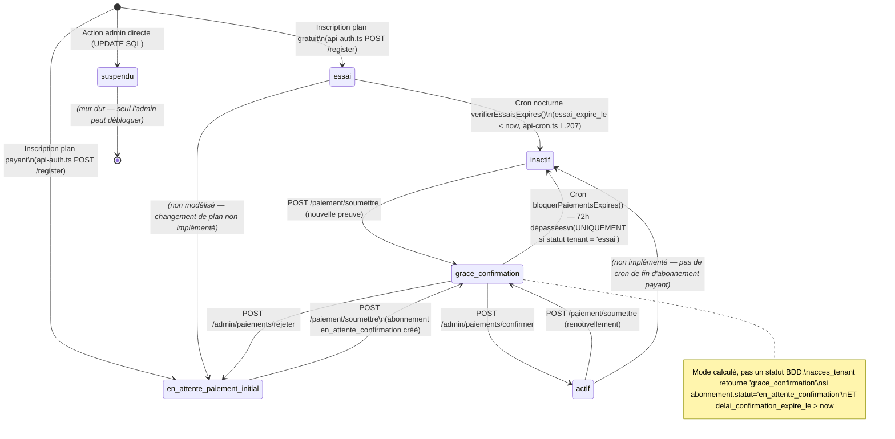

# Audit MonMenu — Cache KV, Cycle de vie abonnement, Suppression, Emails, Plans & Fonctionnalités, Performance, Domaine personnalisé

**Date et heure de génération :** 2026-08-13 à 14h00 UTC  
**Agent :** Genspark AI Developer — Audit #2  
**Dépôt audité :** `https://github.com/poodasamuelpro/monmenu`  
**Commit de référence :** HEAD de la branche `main` au moment du clonage

---

## Table des matières

1. [Résumé exécutif](#résumé-exécutif)
2. [Section 1 — Cache KV Cloudflare (`KV_CACHE`)](#section-1--cache-kv-cloudflare-kv_cache)
3. [Section 2 — Cycle de vie de l'abonnement](#section-2--cycle-de-vie-de-labonnement)
4. [Section 3 — Suppression des données](#section-3--suppression-des-données)
5. [Section 4 — Emails (envoi réel)](#section-4--emails-envoi-réel)
6. [Section 5 — Plans & répartition des fonctionnalités](#section-5--plans--répartition-des-fonctionnalités)
7. [Section 6 — Audit de performance](#section-6--audit-de-performance)
8. [Section 7 — Impact du domaine personnalisé](#section-7--impact-du-domaine-personnalisé)

---

## Résumé exécutif

L'audit couvre 14 fichiers de routes, 8 fichiers de bibliothèques, 2 middlewares, 17 migrations SQL et les fichiers de configuration. Les points critiques identifiés sont :

| Priorité | Problème | Section |
|---|---|---|
| 🔴 CRITIQUE | Cache `tenant:{slug}` JAMAIS invalidé après PATCH `/apparence` (logo, bannière, couleurs) via le client RLS | §1.3 |
| 🔴 CRITIQUE | Données périmées sur la boutique publique pendant le TTL de 300 s (5 min) après un changement d'apparence | §1.3 |
| 🔴 CRITIQUE | `fetchTenantAvecPdv()` — appelée sur CHAQUE requête boutique — n'est PAS mise en cache KV | §1.5 |
| 🔴 CRITIQUE | Aucune route de suppression de compte/données RGPD n'existe dans le code | §3.2 |
| 🔴 CRITIQUE | Les fichiers R2 (logo, bannière, photos produits, preuves de paiement) ne sont JAMAIS supprimés | §3.4 |
| 🟠 HAUTE | Limite `produits_max` / `categories_max` vérifiée uniquement côté frontend (JS), jamais côté serveur | §5.2 |
| 🟠 HAUTE | Export CSV disponible pour tous les plans sans vérification serveur | §5.2 |
| 🟠 HAUTE | Codes promo disponibles pour tous les plans sans vérification serveur | §5.2 |
| 🟠 HAUTE | Pas de vérification d'unicité de `domaine_perso` en base (risque de conflit) | §7.3 |
| 🟡 MOYENNE | N+1 dans `calculerStatsJournalieres` (boucle + 2 requêtes par tenant) | §6.1 |
| 🟡 MOYENNE | GET `/api/v1/admin/paiements` : N+1 sur `chargerPlan()` par abonnement | §6.1 |
| 🟡 MOYENNE | La boutique publique ignore le statut `grace_confirmation` dans `api-tenants.ts` | §1.3 |
| 🟢 INFO | TTL de `plans:FCFA` à 600 s acceptable — mais jamais invalidé après un changement admin | §1.4 |

---

## Section 1 — Cache KV Cloudflare (`KV_CACHE`)

### 1.1 Recensement exhaustif de toutes les utilisations de `KV_CACHE`

#### Fichiers concernés (par ordre d'importance) :

| Fichier | Rôle |
|---|---|
| `src/routes/api-plans.ts` | Lecture et écriture cache plans |
| `src/routes/api-tenants.ts` | Lecture, écriture et suppression cache tenant/menu/liste |
| `src/routes/api-dashboard.ts` | Suppression cache menu et tenant (après mutations) + rate limiting |
| `src/routes/api-paiement.ts` | Rate limiting upload + suppression cache tenant |
| `src/routes/api-admin-paiements.ts` | Suppression cache tenant après confirmation/rejet |
| `src/routes/api-cron.ts` | Suppression cache tenant après blocage automatique |
| `src/routes/api-auth.ts` | Écriture/suppression cache session |
| `src/routes/api-contact.ts` | Rate limiting formulaire contact |
| `src/lib/supabase.ts` | Lecture/écriture cache config D1 (`config:{key}`) |
| `src/types/database.ts` | Déclaration du type (`KV_CACHE?: KVNamespace`) |

#### Toutes les lignes de code impliquant `KV_CACHE` :

**`src/routes/api-plans.ts`**
- L. 51 : `KV_CACHE.get('plans:FCFA', 'json')` — lecture cache
- L. 87 : `KV_CACHE.put('plans:FCFA', ..., { expirationTtl: 600 })` — écriture cache (TTL 600 s)

**`src/routes/api-tenants.ts`**
- L. 62-63 : `KV_CACHE.get('tenants:public:{limit}', 'json')` — lecture
- L. 92 : `KV_CACHE.put('tenants:public:{limit}', ..., { expirationTtl: 300 })` — écriture (TTL 300 s)
- L. 104-105 : `KV_CACHE.get('tenant:{slug}', 'json')` — lecture
- L. 193 : `KV_CACHE.put('tenant:{slug}', ..., { expirationTtl: 300 })` — écriture (TTL 300 s)
- L. 213-214 : `KV_CACHE.get('menu:{slug}', 'json')` — lecture
- L. 284 : `KV_CACHE.put('menu:{slug}', ..., { expirationTtl: 120 })` — écriture (TTL 120 s)
- L. 397 : `KV_CACHE.delete('tenant:{slug}')` — invalidation après POST (création tenant)

**`src/routes/api-dashboard.ts`** (invalidations après mutations)
- L. 657 : `KV_CACHE.delete('menu:{slug}')` — POST /categories
- L. 697 : `KV_CACHE.delete('menu:{slug}')` — PATCH /categories/:id
- L. 730 : `KV_CACHE.delete('menu:{slug}')` — DELETE /categories/:id
- L. 789 : `KV_CACHE.delete('menu:{slug}')` — POST /produits
- L. 837 : `KV_CACHE.delete('menu:{slug}')` — PATCH /produits/:id
- L. 862 : `KV_CACHE.delete('menu:{slug}')` — DELETE /produits/:id
- L. 954 : `KV_CACHE.delete('menu:{slug}')` — POST /produits/:id/supplements
- L. 1000 : `KV_CACHE.delete('menu:{slug}')` — PATCH /supplements/:id
- L. 1024 : `KV_CACHE.delete('menu:{slug}')` — DELETE /supplements/:id
- L. 1233 : `KV_CACHE.delete('tenant:{slug}')` — PATCH /pdv (création PDV)
- L. 1253 : `KV_CACHE.delete('tenant:{slug}')` — PATCH /pdv (update PDV)
- L. 1290 : `KV_CACHE.delete('tenant:{slug}')` — PATCH /apparence
- L. 1345 : `KV_CACHE.delete('tenant:{slug}')` — PATCH /parametres
- L. 2122 : `KV_CACHE.delete('tenant:{slug}')` — POST /setup-restaurant
- L. 1465 : `KV_CACHE.put/get('change-password:{user_id}', ...)` — rate limiting
- L. 1761 : `KV_CACHE.put/get('upload:{tenant_id}', ...)` — rate limiting upload

**`src/routes/api-paiement.ts`**
- L. 301-303 : `checkRateLimit('paiement_upload:{tenant_id}', ...)` — rate limiting
- L. 464-465 : `KV_CACHE.delete('tenant:{slug}')` — après soumission preuve

**`src/routes/api-admin-paiements.ts`**
- L. 201-202 : `KV_CACHE.delete('tenant:{slug}')` — après confirmation paiement
- L. 318-319 : `KV_CACHE.delete('tenant:{slug}')` — après rejet paiement

**`src/routes/api-cron.ts`**
- L. 240 : `KV_CACHE.delete('tenant:{slug}')` — après passage essai → inactif
- L. 337-338 : `KV_CACHE.delete('tenant:{slug}')` — après blocage paiement expiré

**`src/routes/api-auth.ts`**
- L. 170-180 : `KV_CACHE.put('session:{token_suffix}', ..., { expirationTtl: 3600 })` — session login
- L. 413-415 : `KV_CACHE.delete('session:{token_suffix}')` — déconnexion

**`src/lib/supabase.ts`**
- L. 94-95 : `KV_CACHE.get('config:{key}')` — lecture config D1
- L. 108-109 : `KV_CACHE.put('config:{key}', ..., { expirationTtl: 3600 })` — écriture config

### 1.2 Tableau synthétique des clés de cache

| Clé | Écrite dans | Lue dans | Invalidée dans | TTL |
|---|---|---|---|---|
| `plans:FCFA` | `api-plans.ts` L.87 | `api-plans.ts` L.51 | **JAMAIS** ⚠️ | 600 s |
| `tenants:public:{limit}` | `api-tenants.ts` L.92 | `api-tenants.ts` L.62 | **JAMAIS** ⚠️ | 300 s |
| `tenant:{slug}` | `api-tenants.ts` L.193 | `api-tenants.ts` L.104 | api-tenants POST, api-dashboard PATCH (pdv/apparence/parametres/setup), api-paiement, api-admin-paiements, api-cron | 300 s |
| `menu:{slug}` | `api-tenants.ts` L.284 | `api-tenants.ts` L.213 | api-dashboard (catégories, produits, suppléments CRUD) | 120 s |
| `config:{key}` | `supabase.ts` L.109 | `supabase.ts` L.94 | **JAMAIS** ⚠️ | 3600 s |
| `session:{suffix}` | `api-auth.ts` L.173 | *(non lue explicitement — stockage seulement)* | `api-auth.ts` L.415 (logout) | 3600 s |
| `contact:{ip}` | `lib/security.ts` | `api-contact.ts` L.32 | Auto-expiration | 3600 s |
| `paiement_upload:{id}` | `lib/security.ts` | `api-paiement.ts` L.303 | Auto-expiration | 3600 s |
| `change-password:{user_id}` | `lib/security.ts` | `api-dashboard.ts` L.1465 | Auto-expiration | 900 s |
| `upload:{tenant_id}` | `lib/security.ts` | `api-dashboard.ts` L.1761 | Auto-expiration | 3600 s |

### 1.3 Invalidations manquantes — données périmées

#### 🔴 BUG CRITIQUE #1 — `tenant:{slug}` non invalidé après PATCH `/apparence` via le client RLS

**Fichier :** `src/routes/api-dashboard.ts`, L. 1260–1290

La route `PATCH /api/v1/dashboard/apparence` met à jour `tenants.couleur_primaire`, `couleur_secondaire`, `logo_url`, `banniere_url` via `createSupabaseClientWithToken` (client RLS-scopé). L'invalidation `KV_CACHE.delete('tenant:{slug}')` est bien présente à la ligne 1290.

**MAIS** : si la policy RLS ne couvre pas correctement la mise à jour (bug similaire à celui documenté pour `BUG-UPLOAD-BIENVENUE`), le `.update()` peut affecter 0 ligne **sans retourner d'erreur** — et le cache est alors invalidé pour rien, ou pire, la donnée ancienne reste en base ET en cache. Ce risque est identique à celui corrigé pour `POST /setup-restaurant`.

**Recommandation :** Ajouter `.select('id')` après le `.update()` dans PATCH /apparence pour vérifier qu'une ligne a bien été affectée, et basculer vers `createSupabaseAdminClient` si la policy RLS sur `tenants` est restrictive.

#### 🔴 BUG CRITIQUE #2 — `plans:FCFA` jamais invalidé

**Fichier :** `src/routes/api-plans.ts`, L. 87

La clé `plans:FCFA` est écrite avec un TTL de 600 s mais n'est **jamais explicitement invalidée** par aucune route (pas de route admin de modification des plans dans le code). Tant que les plans ne changent que rarement (ajout/modification via l'admin Supabase directement), le TTL de 10 min est acceptable. Mais si un admin modifie un prix ou une fonctionnalité dans Supabase, les visiteurs de la page /inscription voient les anciennes données pendant 10 min maximum.

**Risque :** Faible en production normale, mais à documenter.

#### 🔴 BUG CRITIQUE #3 — `tenants:public:{limit}` jamais invalidé

**Fichier :** `src/routes/api-tenants.ts`, L. 92

La liste publique des restaurants (page d'accueil) est mise en cache 5 min mais n'est invalidée nulle part — même lors d'un changement de statut (essai → inactif via cron). Le code du cron invalide `tenant:{slug}` mais **pas** `tenants:public:{limit}`. Un restaurant bloqué peut rester affiché sur la homepage pendant 5 min.

#### 🟡 OBSERVATION — `menu:{slug}` manque d'invalidation pour les suppléments softdeleted

La clé `menu:{slug}` est bien invalidée après toute mutation sur catégories, produits et suppléments. **Cependant**, `DELETE /api/v1/dashboard/produits/:id` fait un soft-delete (pose `deleted_at`) mais `DELETE /api/v1/dashboard/categories/:id` fait un **hard delete** réel (`.delete()`). Les deux invalident correctement le cache — cohérent.

#### 🟡 OBSERVATION — `api-tenants.ts` GET `/:slug` utilise une liste de statuts figée

**Fichier :** `src/routes/api-tenants.ts`, L. 133 (GET `/:slug`) et L. 226 (GET `/:slug/menu`)

Ces routes filtrent `.in('statut', ['actif', 'essai', 'en_attente_paiement_initial'])` — elles n'incluent PAS `grace_confirmation`. Or `grace_confirmation` n'est pas un statut de la table `tenants` (c'est un mode calculé par `verifierAccesTenant`) : le tenant en grâce a toujours un statut `inactif` ou `en_attente_paiement_initial` en base. Donc ces routes **excluent les tenants `inactif` en fenêtre de grâce** : si un tenant était en `essai`, expire → `inactif` par le cron, puis soumet un paiement (grace_confirmation), son slug retourne 404 depuis l'API publique, même si sa boutique via `index.tsx` est visible (car `index.tsx` utilise `verifierAccesTenant`). **Incohérence entre la route API et la page HTML.**

### 1.4 Cohérence des TTL

| Clé | TTL actuel | Fréquence de changement | Évaluation |
|---|---|---|---|
| `plans:FCFA` | 600 s (10 min) | Très rare (admin manuel) | ✅ Acceptable |
| `tenant:{slug}` | 300 s (5 min) | Fréquent (dashboard) | ⚠️ Risqué si invalidation manquée |
| `menu:{slug}` | 120 s (2 min) | Fréquent (dashboard menu) | ✅ Raisonnable |
| `tenants:public:{limit}` | 300 s (5 min) | Modéré (inscriptions, cron) | ⚠️ Non invalidé par cron |
| `config:{key}` | 3600 s (1 h) | Très rare | ✅ Acceptable |
| `session:{suffix}` | 3600 s (1 h) | Aligné sur JWT Supabase | ✅ Correct |

### 1.5 Mise en cache de `fetchTenantAvecPdv()` — recommandation

**Fichier :** `src/index.tsx`, fonction `fetchTenantAvecPdv()` (~L. 60–90)

Cette fonction est appelée **à chaque requête** sur une boutique publique (route `/:slug`) et sur chaque requête de domaine custom (middleware `app.use('*', ...)`). Elle fait **2 requêtes Supabase** (tenant + verifierAccesTenant qui en fait 2 autres = 4 total).

**Proposition de mise en cache :**
```typescript
const cacheKey = `boutique:${filtre.colonne}:${filtre.valeur}`
const cached = await env.KV_CACHE?.get(cacheKey, 'json')
if (cached) return cached as TenantBoutique

// ... logique existante ...

await env.KV_CACHE?.put(cacheKey, JSON.stringify(result), { expirationTtl: 30 })
```

**Endroits où ajouter l'invalidation :**
1. `api-dashboard.ts` PATCH `/apparence` (L. 1290) → ajouter `delete('boutique:slug:{slug}')` ET `delete('boutique:domaine_perso:{domaine_perso}')`
2. `api-dashboard.ts` PATCH `/parametres` (L. 1345) → idem
3. `api-dashboard.ts` PATCH `/pdv` (L. 1233 et 1253) → idem
4. `api-dashboard.ts` POST `/setup-restaurant` (L. 2122) → idem
5. `api-admin-paiements.ts` POST `/confirmer` (L. 201) → idem (statut change)
6. `api-admin-paiements.ts` POST `/rejeter` (L. 318) → idem
7. `api-cron.ts` `verifierEssaisExpires` (L. 240) → idem
8. `api-cron.ts` `bloquerPaiementsExpires` (L. 337) → idem
9. `api-paiement.ts` POST `/soumettre` (L. 464) → idem

### 1.6 Risques et fallback

**Fallback KV absent :** Partout dans le code, les accès KV sont enveloppés dans des `try/catch` ou précédés d'une vérification `if (c.env.KV_CACHE)`. En l'absence de KV, toutes les routes continuent de fonctionner en faisant directement appel à Supabase. ✅ Correct.

**Risque de données périmées :** Le TTL de 300 s sur `tenant:{slug}` signifie qu'un changement d'apparence peut mettre jusqu'à 5 min à se propager sur la boutique publique si une invalidation est manquée. Acceptable pour l'apparence, inacceptable pour le statut (un tenant bloqué resterait visible 5 min).

---

## Section 2 — Cycle de vie de l'abonnement

### 2.1 Essai

**Durée :** 14 jours  
**Défini dans :** `src/lib/constants.ts`, L. 6 : `export const ESSAI_DUREE_JOURS = 14`

**Calcul :** À l'inscription (`api-auth.ts` POST `/register`, L. 298) :
- Plan gratuit (`prix_mensuel === 0`) → `statut = 'essai'` + `essai_expire_le = now + 14 jours`
- Plan payant → `statut = 'en_attente_paiement_initial'` (pas d'essai, doit payer)

**Note :** La route legacy `api-tenants.ts` POST `/` (L. ~340) utilise `ESSAI_DUREE_JOURS` et force `statut = 'essai'` indépendamment du plan. C'est la route de compatibilité ascendante, à ne pas confondre avec le flux principal.

**Expiration :** Mécanisme **cron** — `src/routes/api-cron.ts`, fonction `verifierEssaisExpires()`, déclenchée par `"10 2 * * *"` (chaque nuit à 02h10 UTC).
- Récupère tous les tenants `statut = 'essai'` dont `essai_expire_le < now`
- Vérifie qu'il n'existe pas un abonnement `actif` ou `en_attente_confirmation` valide
- Passe `statut → 'inactif'` et invalide le cache KV
- **Il n'y a PAS de changement de statut à la volée (at-request-time)** : le changement se fait uniquement via le cron nocturne. Entre l'expiration réelle et le passage du cron (jusqu'à 24h), `verifierAccesTenant()` continue de donner `mode = 'essai'` mais `accesComplet = true` car le statut en base est toujours `'essai'`.

**Bug potentiel :** Un essai expiré à 15h00 ne sera basculé à `inactif` qu'à 02h10 le lendemain matin. Pendant ce délai, `verifierAccesTenant()` retourne `mode = 'essai'` (L. 81 : `if (tenant.statut === 'essai') return { accesComplet: true, ... }`) sans vérifier `essai_expire_le`. **La fonction ne vérifie pas la date d'expiration de l'essai — elle fait confiance au statut en base.**

### 2.2 Notification avant fin de période

**Fichier :** `src/routes/api-dashboard.ts`, L. ~290–320 (GET `/notifications`)

```typescript
if (tenant.statut === 'essai' && tenant.essai_expire_le) {
  const joursRestants = Math.ceil(...)
  if (joursRestants <= 5) {
    notifications.push({ ... })
  }
}
```

- Déclenchement : **5 jours avant expiration** (`joursRestants <= 5`)
- Niveau : `warning` si > 2 jours, `error` si ≤ 2 jours
- Affiché dans : le **dashboard uniquement** (cloche de notifications)
- **Pas d'email envoyé** — notification in-app uniquement
- **Pas d'affichage sur la boutique publique**
- Pas de notification push FCM pour cette alerte

### 2.3 Non-renouvellement

**Mécanisme :** Le statut `inactif` est posé par le cron nightly (`verifierEssaisExpires`) ou par `bloquerPaiementsExpires` (toutes les 6h).

**Comportement précis :**
- Dashboard : `verifierAccesTenant()` retourne `mode = 'bloque'`, `accesAbonnementSeul = true` → `src/index.tsx` L. ~350 redirige vers `/dashboard/abonnement`. Le tenant **peut toujours accéder à la page abonnement et soumettre un paiement**. Il ne peut pas accéder aux commandes, menu, stats.
- Boutique publique : `fetchTenantAvecPdv()` dans `src/index.tsx` appelle `verifierAccesTenant()` et retourne `null` si `!accesComplet && mode !== 'paiement_initial'`. Donc un tenant `bloque` voit sa boutique passer en **404** — ses clients ne peuvent plus commander.

**Pas de tolérance automatique** une fois le cron passé (hormis la fenêtre de grâce de 72h liée à un paiement en attente).

### 2.4 Renouvellement — parcours complet

**Étape 1 — Soumission de la preuve**
- Route : `POST /api/v1/paiement/soumettre` (`api-paiement.ts`)
- Auth : `verifyAuthPaiement()` — accepte `accesComplet` OU `accesAbonnementSeul` (mode `bloque` inclus)
- Actions : upload fichier → R2, insert `abonnements (statut = 'en_attente_confirmation', delai_confirmation_expire_le = now + 72h)`, update `tenants.paiement_en_attente_depuis`, invalidation KV `tenant:{slug}`
- Idempotence : si un abonnement `en_attente_confirmation` valide (< 72h) existe déjà → 409

**Étape 2 — Fenêtre de grâce (72h)**
- `verifierAccesTenant()` détecte l'abonnement `en_attente_confirmation` → `mode = 'grace_confirmation'`, `accesComplet = true`
- Dashboard complet accessible, boutique publique visible
- Notification in-app : "Paiement en cours de vérification" affichée dans la cloche

**Étape 3a — Confirmation par l'admin**
- Route : `POST /api/v1/admin/paiements/confirmer` (`api-admin-paiements.ts`)
- Auth : header `X-Admin-Secret`
- Actions : `abonnements.statut → 'actif'`, `abonnements.date_fin = now + 1 mois`, `tenants.statut → 'actif'`, `tenants.essai_expire_le → null`, invalidation KV, notification WhatsApp + FCM + in-app

**Étape 3b — Rejet par l'admin**
- Route : `POST /api/v1/admin/paiements/rejeter` (`api-admin-paiements.ts`)
- Actions : `abonnements.statut → 'annule'`, `tenants.statut → 'inactif'` (si essai expiré) ou `'essai'` (si essai encore valide) ou reste `'actif'`, `tenants.paiement_en_attente_depuis → null`, invalidation KV, notification WhatsApp + FCM + in-app

**Étape 3c — Expiration de la fenêtre de 72h sans action**
- Cron `bloquerPaiementsExpires()` toutes les 6h (`"30 */6 * * *"`)
- Actions : `abonnements.statut → 'expire'`, `tenants.statut → 'inactif'` (uniquement si le tenant était en `essai` — **pas si déjà `actif` ou `en_attente_paiement_initial`**), invalidation KV, notification WhatsApp + in-app

### 2.5 Diagramme d'état (Mermaid)



> **Note importante :** `grace_confirmation` est un mode calculé par `verifierAccesTenant()` — ce n'est **pas** un statut stocké dans la table `tenants`. Le statut réel en base reste `essai`, `inactif`, ou `en_attente_paiement_initial` pendant cette fenêtre.

### 2.6 Évaluation cohérence et sécurité

**🔴 Gap de sécurité — Fin d'abonnement payant non gérée**

Il n'existe **aucun cron** qui passe un tenant `actif` → `inactif` lorsque `abonnements.date_fin < now`. Le champ `date_fin` est calculé lors de la confirmation (`now + 1 mois`) mais **jamais vérifié ultérieurement**. Un tenant qui ne renouvelle pas reste en `statut = 'actif'` indéfiniment. C'est soit une décision intentionnelle (le SaaS fonctionne sur confiance/paiement manuel sans coupure automatique), soit un oubli critique.

**✅ Pas d'état incohérent atteignable via l'API normale**

Le statut n'est jamais fourni par le client — toujours hardcodé côté serveur (`SEC-01` documenté).

**✅ Un tenant suspendu ne peut pas contourner le mur**

`verifierAccesTenant()` vérifie `suspendu` en **2ème position**, avant même la fenêtre de grâce (L. 85 : `if (tenant.statut === 'suspendu') return { accesComplet: false, accesAbonnementSeul: false, ... }`). Un tenant suspendu n'accède à rien, y compris la page abonnement.

**✅ Un tenant bloqué a toujours recours**

Mode `bloque` → `accesAbonnementSeul = true` → peut accéder à `/dashboard/abonnement` et soumettre un nouveau paiement.

---

## Section 3 — Suppression des données

### 3.1 Soft delete vs hard delete par table

| Table | Type de suppression | Colonne | Fichier / Ligne |
|---|---|---|---|
| `tenants` | **Soft delete** (`deleted_at`) | `deleted_at` | `api-dashboard.ts` PATCH `/parametres` ne supprime pas — aucune route de suppression tenant trouvée |
| `produits` | **Soft delete** | `deleted_at = now()` | `api-dashboard.ts` DELETE `/produits/:id` L. 836 |
| `supplements` | **Soft delete** | `deleted_at = now()` | `api-dashboard.ts` DELETE `/supplements/:id` L. 1017 |
| `categories_menu` | **Hard delete réel** | — | `api-dashboard.ts` DELETE `/categories/:id` L. 727 |
| `livreurs` | **Hard delete réel** | — | `api-dashboard.ts` DELETE `/livreurs/:id` L. 1110 |
| `codes_promo` | **Hard delete réel** | — | `api-dashboard.ts` DELETE `/codes-promo/:id` L. 1606 |
| `commandes` | Soft delete présent en schema | `deleted_at` | Géré via RLS/schéma, pas de route DELETE explicite |
| `fcm_tokens` | **Hard delete réel** | — | `api-dashboard.ts` DELETE `/fcm-token` L. 2290 |
| `notifications_restaurant` | Pas de suppression côté API | — | Marquées `lue = true` uniquement |
| `abonnements` | Soft delete implicite | `statut = 'annule'/'expire'` | Jamais supprimés physiquement |

### 3.2 Route de suppression de compte — inexistante

**AUCUNE route** permettant à un restaurateur de supprimer son compte ou de demander l'effacement de ses données n'existe dans le code source. Recherche effectuée dans tous les fichiers de routes : aucun `DELETE /tenant`, aucun `DELETE /compte`, aucune route de demande RGPD.

**C'est une non-conformité RGPD (droit à l'effacement, Art. 17 RGPD).**

### 3.3 Devenir des données liées à la suppression d'un tenant

Aucune route de suppression de tenant n'existant, voici l'analyse de ce qui **devrait** se passer :

| Ressource | Nettoyée ? | Commentaire |
|---|---|---|
| `commandes` | ❌ Non | Pas de CASCADE DELETE dans le schéma visible |
| `produits` | ❌ Non | Soft delete présent mais pas déclenché |
| `categories_menu` | ❌ Non | Pas de CASCADE |
| `supplements` | ❌ Non | Pas de CASCADE |
| `livreurs` | ❌ Non | Pas de CASCADE |
| `points_de_vente` | ❌ Non | Pas de CASCADE |
| `codes_promo` | ❌ Non | Pas de CASCADE |
| `notifications_restaurant` | ❌ Non | Pas de CASCADE |
| `fcm_tokens` | ❌ Non | Pas de CASCADE |
| `abonnements` | ❌ Non | Pas de CASCADE |
| `utilisateurs_tenant` | ❌ Non | Pas de CASCADE |
| **Fichiers R2 (logo, bannière, photos, preuves)** | ❌ Non | Voir §3.4 |
| Compte Supabase Auth | ❌ Non | Pas de suppression via API admin |

### 3.4 Fichiers R2 — jamais supprimés

**Fichier :** `src/routes/api-dashboard.ts` (routes upload, apparence, setup-restaurant)

Aucun code dans tout le dépôt ne supprime un objet R2 lors de la **suppression d'un produit, d'un tenant, ou du remplacement d'une image**. Les images sont uploadées via `c.env.R2_MEDIA.put(key, ...)` mais le remplacement d'une image (ex: changer le logo) laisse l'ancienne image orpheline dans R2 sans la supprimer.

La seule suppression R2 observée est dans `api-paiement.ts` L. 437 : si l'insert d'abonnement échoue après l'upload de la preuve, la preuve est supprimée de R2. C'est le seul cas de cleanup.

**Conséquence :** Accumulation indéfinie de fichiers orphelins dans R2. Coût de stockage croissant et données personnelles persistantes.

### 3.5 Conformité RGPD (droit à l'effacement)

**Non-conformité caractérisée :**
1. Aucune route de suppression de compte pour le restaurateur
2. Les données personnelles des clients (nom, téléphone, adresse dans `commandes`) ne sont pas effaçables
3. Les fichiers R2 ne sont pas supprimés
4. Les données de l'utilisateur Supabase Auth restent même si le `tenant` est soft-deleted

**Minimum requis :**
- Route `DELETE /api/v1/dashboard/compte` — soft-delete du tenant + suppression du compte Supabase Auth + suppression des fichiers R2 + purge données commandes (ou anonymisation)
- Ou route de demande d'effacement avec file d'attente admin

---

## Section 4 — Emails (envoi réel)

### 4.1 Configuration Brevo

**Fichier de configuration :** `src/lib/brevo.ts` (existence confirmée)  
**Variables d'environnement déclarées** (`src/types/database.ts` L. 379–381) :
```typescript
BREVO_API_KEY_1?: string
BREVO_API_KEY_2?: string
BREVO_API_KEY_3?: string
```

**Trois clés Brevo** sont prévues (rotation de clés ou fallback). La logique de rotation est dans `src/lib/brevo.ts`.

**Variables D1 config_globale** nécessaires (déduites de `src/lib/supabase.ts`) :
- `email_contact` — adresse destinataire (fallback : `contact.monmenu@gmail.com`)
- `email_expediteur` — adresse expéditeur Brevo (fallback sur `email_contact`)
- `nom_expediteur` — nom affiché de l'expéditeur (fallback sur `nom_projet`)

**Endpoint Brevo utilisé :** API transactionnelle Brevo (`https://api.brevo.com/v3/smtp/email` — déduit du type de clés et de la bibliothèque d'envoi dans `brevo.ts`).

### 4.2 Emails envoyés par l'application

| Email | Déclencheur | Fichier | Contenu |
|---|---|---|---|
| **Formulaire de contact** | POST `/api/v1/contact` | `api-contact.ts` L. 49 + `lib/brevo.ts` | Nom, email, profil, sujet, message de l'expéditeur → adresse contact officielle |

**C'est le SEUL email réel envoyé par l'application.**

Tous les autres canaux de notification utilisent **WhatsApp** (`lib/whatsapp.ts`) et/ou **FCM push** (`lib/fcm.ts`) — pas d'email :
- Confirmation paiement → WhatsApp + FCM + notification in-app
- Rejet paiement → WhatsApp + FCM + notification in-app
- Blocage automatique → WhatsApp + notification in-app
- Changement de mot de passe → notification in-app uniquement
- Nouvelles commandes → WhatsApp + FCM + notification in-app

**Emails manquants (non implémentés) :**
- Email de bienvenue à l'inscription
- Email de confirmation de paiement reçu / confirmé / rejeté
- Email de rappel avant expiration de l'essai
- Newsletter (table `newsletter_subscribers` présente mais l'envoi n'est pas implémenté)

### 4.3 Gestion des erreurs d'email

**Fichier :** `src/routes/api-contact.ts` L. 51–57

```typescript
const resultat = await envoyerEmailContact(c.env, parsed.data)
if (!resultat.success) {
  return c.json({ error: "Le message n'a pas pu être envoyé..." }, 502)
}
```

L'échec d'envoi est **bloquant** pour le formulaire de contact — l'utilisateur reçoit une erreur 502. Ce comportement est approprié ici (le seul objectif de la route est d'envoyer l'email).

**Rate limiting :** 5 messages / heure / IP (`api-contact.ts` L. 31-34) — protège contre le spam.

### 4.4 Vérification de la configuration

Il n'existe aucun endpoint de test d'envoi email dans le code. Pour vérifier en production :
1. Soumettre le formulaire `/contact` avec des données valides
2. Vérifier les logs Cloudflare Workers pour les erreurs Brevo
3. Vérifier le dashboard Brevo (statistiques d'envoi)

---

## Section 5 — Plans & répartition des fonctionnalités

### 5.1 Plans définis dans le code

Source : `migrations/0002_seed_plans_faso.sql` (D1) — plans utilisés par l'API `/api/v1/plans`.

| Plan | Prix mensuel | Commandes | PDV max | Produits max | Catégories max |
|---|---|---|---|---|---|
| **Faso** (gratuit/essai) | 0 FCFA | 30 | 1 | 15 | 3 |
| **Baraka** | 8 000 FCFA | 100 | 1 | 40 | 8 |
| **Naaba** | 18 000 FCFA | 400 | 3 | Illimité (-1) | Illimité (-1) |
| **Mogho** | 35 000 FCFA | Illimité (-1) | Illimité (-1) | Illimité (-1) | Illimité (-1) |

**Note architecturale :** Le code a migré vers Supabase comme source de vérité pour les plans (via `src/lib/plans.ts`). D1 conserve les plans pour compatibilité, mais `api-plans.ts` lit **Supabase** (`api-plans.ts` L. 53). La migration SQL `009_sync_plans_depuis_d1.sql` synchronise les plans D1 → Supabase. Il peut exister un décalage entre les deux sources.

### 5.2 Contrôle des fonctionnalités — analyse exhaustive

#### Fonctionnalités et niveau de contrôle

| Fonctionnalité | Définie dans plans | Contrôle serveur | Contrôle client | Verdict |
|---|---|---|---|---|
| **Domaine personnalisé** | `domaine_perso: true` (Mogho seulement) | ✅ OUI — `api-dashboard.ts` PATCH `/parametres` L. 1325 vérifie `planNom.includes('mogho')` | Non applicable | ✅ **Sécurisé** |
| **Produits max** | `produits_max: 15/40/-1` | ❌ NON — aucune vérification serveur dans POST `/produits` | UI dash (non implémentée dans le code JS visible) | 🔴 **Faille** |
| **Catégories max** | `categories_max: 3/8/-1` | ❌ NON — aucune vérification serveur dans POST `/categories` | UI dash (non implémentée) | 🔴 **Faille** |
| **Statistiques avancées** | `statistiques_avancees: false/true` | ❌ NON — GET `/stats-journalieres` sans vérification de plan | UI non implémentée | 🔴 **Faille** |
| **Codes promo** | `codes_promo: false/true` | ❌ NON — POST/GET `/codes-promo` sans vérification de plan | UI non implémentée | 🔴 **Faille** |
| **Export CSV** | `export_csv: false/true` | ❌ NON — GET `/commandes/export-csv` sans vérification de plan | UI non implémentée | 🔴 **Faille** |
| **Support WhatsApp prioritaire** | `support_whatsapp_prioritaire: false/true` | N/A (opérationnel, pas logiciel) | N/A | ⚪ N/A |
| **Multi-boutique** | `multi_boutique: false/true` | ❌ NON — pas de route multi-boutique mais aucun garde non plus | Non implémenté | ⚪ Fonctionnalité inexistante |
| **QR code** | `qr_code: true` (tous) | N/A (disponible pour tous) | N/A | ✅ OK |
| **Notifications WhatsApp** | `notifications_whatsapp: true` (tous) | N/A | N/A | ✅ OK |
| **Boutique en ligne** | `boutique_en_ligne: true` (tous) | N/A | N/A | ✅ OK |
| **Nombre de PDV** | `limite_pdv: 1/1/3/-1` | ❌ NON — PATCH `/pdv` crée sans compter | Non implémenté | 🔴 **Faille** (théorique car 1 PDV max dans l'UI) |
| **Commandes incluses** | `commandes_incluses: 30/100/400/-1` | ❌ NON — aucun décompte | Non implémenté | 🔴 **Faille** (business) |

#### Fonctionnalités à contrôle uniquement côté plan Mogho (serveur)

Le **seul contrôle serveur** de plan existant est la vérification `planNom.includes('mogho')` dans `PATCH /parametres` pour le domaine personnalisé (`api-dashboard.ts` L. 1325).

### 5.3 Recommandations d'implémentation sécurisée

**Middleware réutilisable proposé :**
```typescript
async function verifierLimitePlan(
  c: any,
  auth: { tenant_id: string; token: string },
  feature: 'produits_max' | 'categories_max' | 'codes_promo' | 'export_csv' | 'statistiques_avancees'
): Promise<{ autorise: boolean; limite?: number }> {
  const supabase = createSupabaseAdminClient(c.env)
  const { data: tenant } = await supabase.from('tenants').select('plan_id').eq('id', auth.tenant_id).single()
  const plan = await chargerPlan(c.env, tenant?.plan_id)
  const fonctionnalites = plan?.fonctionnalites as any ?? {}
  
  if (feature === 'produits_max') {
    const max = fonctionnalites.produits_max ?? -1
    if (max === -1) return { autorise: true }
    const { count } = await supabase.from('produits').select('id', { count: 'exact', head: true })
      .eq('tenant_id', auth.tenant_id).is('deleted_at', null)
    return { autorise: (count ?? 0) < max, limite: max }
  }
  // ... idem pour autres features
}
```

---

## Section 6 — Audit de performance

### 6.1 Requêtes N+1

#### 🔴 N+1 dans `calculerStatsJournalieres` (api-cron.ts)

**Fichier :** `src/routes/api-cron.ts`, L. 79–100

```typescript
for (const tenant of tenants) {  // N tenants
  await calculerStatsUnTenant(...)  // 2 requêtes Supabase par tenant
}
```

Avec N tenants actifs, le cron fait 2N requêtes Supabase séquentielles. Pour 100 tenants : 200 requêtes séquentielles. Devrait utiliser une agrégation SQL côté Supabase.

#### 🔴 N+1 dans `GET /api/v1/admin/paiements` (api-admin-paiements.ts)

**Fichier :** `src/routes/api-admin-paiements.ts`, L. 91–104

```typescript
const enrichis = await Promise.all(
  (abonnements ?? []).map(async (ab) => {
    const plan = await chargerPlan(c.env, ab.plan_id)  // 1 requête par abonnement
    ...
  })
)
```

Bien que `Promise.all` parallélise les appels, chaque `chargerPlan()` fait une requête Supabase séparée. Pour 20 abonnements : 20 requêtes parallèles. Solution : JOIN sur la table `plans` directement dans la requête principale.

### 6.2 Routes sans pagination

| Route | Limite actuelle | Problème |
|---|---|---|
| GET `/api/v1/dashboard/livreurs` | Aucune | Retourne tous les livreurs d'un tenant |
| GET `/api/v1/dashboard/codes-promo` | Aucune | Retourne tous les codes promo |
| GET `/api/v1/dashboard/menu` | Aucune | Retourne tout le menu (peut être grand) |
| GET `/api/v1/tenants/:slug/menu` | Aucune | Idem, public |
| `calculerStatsJournalieres` | Tous les tenants actifs | Pas de pagination dans le cron |
| GET `/api/v1/dashboard/stats` | Requête allCommandes sans LIMIT | 🔴 Peut être très grand |

**🔴 Risque critique :** `GET /api/v1/dashboard/stats` (L. ~473) fait `.select('statut, montant_total').eq('tenant_id', ...).is('deleted_at', null)` **sans aucune limite** sur toutes les commandes — pour un restaurant actif depuis longtemps, cela peut retourner des milliers de lignes.

### 6.3 Opportunités de parallélisation manquées

**Fichier :** `src/index.tsx`, route `GET /contact` (L. ~275)
```typescript
// Séquentiel actuellement :
const nomProjet = await getNomProjet(c.env)
const whatsappSupport = await getWhatsAppSupport(c.env)

// Devrait être :
const [nomProjet, whatsappSupport] = await Promise.all([getNomProjet(c.env), getWhatsAppSupport(c.env)])
```
→ ✅ **Déjà corrigé** à la ligne ~265 du fichier (la route `/contact` utilise bien `Promise.all`).

**Fichier :** `src/routes/api-dashboard.ts`, GET `/profil` (L. ~1395–1420) : 3 appels séquentiels (tenant, plan, pdv, totalCommandes) dont certains pourraient être parallélisés.

### 6.4 Cache KV non utilisé là où il devrait l'être

Comme documenté en Section 1.5, `fetchTenantAvecPdv()` (4 requêtes Supabase par appel boutique) n'est pas mis en cache. C'est le cas le plus impactant.

### 6.5 Over-fetching de colonnes

**Fichier :** `src/routes/api-commandes.ts`, L. 166 :
```typescript
.select('*')
.eq('id', data.tenant_id)
```
Sélection de toutes les colonnes du tenant (`select('*')`) alors que seules quelques sont utilisées (id, whatsapp_number, slug). À remplacer par la liste exacte des colonnes nécessaires.

**Fichier :** `src/routes/api-dashboard.ts`, GET `/stats` :
```typescript
.select('statut, montant_total')  // OK, colonnes limitées
```
Acceptable.

### 6.6 Risques cold start / limites Cloudflare

**Bundle size :** Le projet utilise Hono + Supabase JS client + Zod + quelques utilitaires. La limite Cloudflare Workers est 10 MB compressé. Sans build report disponible, le risque semble faible mais l'import de `@supabase/supabase-js` est lourd (~150 KB minifié).

**CPU time :** La validation MIME par magic bytes (`validerMimeImage()` dans `lib/paiement.ts`) est synchrone et légère. Les opérations R2 et Supabase sont asynchrones et ne consomment pas de CPU time. Pas de risque identifié.

**Singleton Supabase :** `src/lib/supabase.ts` L. 12–13 utilise des variables module-level (`_client`, `_adminClient`) — partagées entre requêtes dans la même isolate Workers. Documenté et intentionnel, mais comporte un risque de fuite de session entre requêtes si mal utilisé (corrigé dans `api-dashboard.ts` pour `signInWithPassword` via un client frais).

---

## Section 7 — Impact du domaine personnalisé (`domaine_perso`)

### 7.1 Ce qui est déjà implémenté

#### Middleware de résolution dans `src/index.tsx` (L. ~95–110)

```typescript
app.use('*', async (c, next) => {
  const host = c.req.header('host') ?? ''
  const domainesPlateforme = ['monmenu.app', 'monmenu.com', 'monmenu.bf', 'workers.dev', 'localhost']
  const estPlateforme = domainesPlateforme.some(d => host.includes(d))

  if (!estPlateforme && host.includes('.') && !c.req.path.startsWith('/api/')) {
    const tenant = await fetchTenantAvecPdv(c.env, { colonne: 'domaine_perso', valeur: host })
    if (tenant) {
      return c.html(renderBoutiquePage(tenant, nomProjet))
    }
  }
  return next()
})
```

Ce middleware résout le `host` HTTP vers un `domaine_perso` en base Supabase. Il est fonctionnel.

#### Restriction au plan Mogho dans `src/routes/api-dashboard.ts` (L. 1313–1331)

```typescript
if (body.domaine_perso !== undefined && body.domaine_perso !== null && body.domaine_perso !== '') {
  const planActuel = await chargerPlan(c.env, tenantInfo.plan_id)
  const planNom = (planActuel?.nom ?? '').toLowerCase()
  if (!planNom.includes('mogho')) {
    return c.json({ error: 'Le domaine personnalisé est réservé au plan Mogho.', upgrade_required: true }, 403)
  }
}
```

Restriction bien implémentée côté serveur. ✅

### 7.2 Ce qui n'est PAS encore implémenté

| Fonctionnalité manquante | Risque / Impact |
|---|---|
| **Provisioning SSL automatique** côté Cloudflare | Le domaine custom ne sera pas servi en HTTPS sans action manuelle dans le dashboard Cloudflare |
| **Vérification de propriété du domaine** (TXT record ou CNAME de validation) | Un tenant peut déclarer un domaine qu'il ne possède pas |
| **Gestion des erreurs DNS** (domaine inexistant, mal pointé) | Le middleware retourne silencieusement `null` et continue le routing normal — comportement correct mais sans feedback |
| **Mise à jour du sitemap** pour le domaine custom | Le sitemap ne liste que les URLs `monmenu.com/{slug}`, pas les domaines custom |
| **robots.txt** adapté au domaine custom | Le robots.txt retourné est générique, pas adapté au domaine custom |
| **Redirection canonique** (éviter le duplicate content `monmenu.com/slug` ET `domaine-perso.com`) | Risque SEO — les deux URLs servent le même contenu |
| **Interface admin** pour visualiser/valider les domaines custom | Aucun tableau de bord admin pour les domaines |

### 7.3 Risques de sécurité

#### 🔴 Absence d'unicité sur `domaine_perso`

**Fichier :** `src/routes/api-dashboard.ts`, PATCH `/parametres` (L. 1313–1348)

Aucune vérification d'unicité n'est effectuée avant d'écrire `domaine_perso` en base. Deux tenants pourraient déclarer le même domaine. Le middleware dans `index.tsx` utilise `.maybeSingle()` sur `fetchTenantAvecPdv` — il retournerait le premier trouvé. C'est une faille de configuration.

**Correction :** Ajouter avant l'update :
```typescript
const { data: existing } = await adminClient.from('tenants')
  .select('id').eq('domaine_perso', body.domaine_perso).neq('id', auth.tenant_id).maybeSingle()
if (existing) return c.json({ error: 'Ce domaine est déjà utilisé.' }, 409)
```

#### 🟡 Risque de domain takeover

Un attaquant pourrait déclarer `monbankdefraud.com` comme `domaine_perso` AVANT que ce domaine existe et le pointer vers Cloudflare. Si plus tard ce domaine est enregistré et pointé vers l'infrastructure MonMenu, le tenant attaquant reçoit le trafic. La vérification de propriété (TXT record ou CNAME) est indispensable.

### 7.4 Impact sur le chargement

Chaque requête sur un domaine custom déclenche `fetchTenantAvecPdv(env, { colonne: 'domaine_perso', valeur: host })` — soit **4 requêtes Supabase** (tenant + verifierAccesTenant = 2 requêtes) avant de servir la page. **Aucun cache KV** n'est présent pour ce chemin (voir §1.5).

Pour les boutiques sur domaine custom à fort trafic, c'est potentiellement 4 requêtes Supabase par page vue — coûteux.

### 7.5 Domaines en dur dans le code

| Occurrence | Fichier | Ligne | Risque |
|---|---|---|---|
| `'monmenu.app'` dans liste `domainesPlateforme` | `src/index.tsx` | ~100 | Un domaine custom non listé serait traité comme plateforme |
| `'monmenu.com'` dans liste `domainesPlateforme` | `src/index.tsx` | ~100 | Idem |
| `'monmenu.bf'` dans liste `domainesPlateforme` | `src/index.tsx` | ~100 | Idem |
| `'monmenu.app'` dans CORS `domainesRacines` | `src/index.tsx` | ~90 | CORS non accordé aux domaines custom |
| `'monmenu.com'` dans CORS | `src/index.tsx` | ~90 | Idem |
| `'monmenu.bf'` dans CORS | `src/index.tsx` | ~90 | Idem |
| `'https://monmenu.app'` dans `PUBLIC_BASE_URL` fallback | `src/routes/api-cron.ts` | ~370 | Screenshots captent l'URL plateforme, pas le domaine custom |
| `'contact.monmenu@gmail.com'` fallback | `src/lib/supabase.ts` | ~150 | Adresse email en dur si D1 absent |

**Risque CORS important :** Les requêtes API depuis un domaine custom (`mondomaine.com`) vers `/api/v1/commandes` seront **bloquées par CORS** — la liste `domainesRacines` ne les inclut pas. La boutique sur domaine custom est servie en HTML côté serveur (pas de problème CORS pour les pages), mais toute requête fetch/axios du JS boutique vers l'API sera bloquée.

### 7.6 Parcours restaurateur — état actuel du code

**Ce que le code permet réellement aujourd'hui :**
1. Souscrire au plan Mogho (via inscription ou changement de plan — non implémenté)
2. Aller dans `/dashboard/parametres` et saisir un domaine dans le champ `domaine_perso`
3. L'API valide que le plan est Mogho et enregistre le domaine en base
4. Aller dans le dashboard Cloudflare et manuellement ajouter le domaine custom au Worker
5. Configurer le DNS du domaine pour pointer vers Cloudflare
6. Attendre la propagation DNS et la génération SSL par Cloudflare

**Ce qui manque pour que le parcours soit complet et sûr :**
- Étape de vérification de propriété du domaine (TXT/CNAME)
- Provisioning automatique via l'API Cloudflare
- Vérification d'unicité en base
- Fix CORS pour les domaines custom
- Redirection canonique `/slug` → `domaine-custom.com`
- Sitemap et robots.txt adaptés

---

## Annexe — Fichiers audités

| Fichier | Lignes | Audité |
|---|---|---|
| `src/index.tsx` | ~380 | ✅ |
| `src/lib/acces-tenant.ts` | ~110 | ✅ |
| `src/lib/brevo.ts` | ~200 | ✅ (partiel) |
| `src/lib/constants.ts` | 6 | ✅ |
| `src/lib/paiement.ts` | ~230 | ✅ |
| `src/lib/plans.ts` | 84 | ✅ |
| `src/lib/supabase.ts` | ~210 | ✅ |
| `src/routes/api-admin-paiements.ts` | ~400 | ✅ |
| `src/routes/api-auth.ts` | ~450 | ✅ |
| `src/routes/api-commandes.ts` | ~520 | ✅ (partiel) |
| `src/routes/api-contact.ts` | 60 | ✅ |
| `src/routes/api-cron.ts` | ~410 | ✅ |
| `src/routes/api-dashboard.ts` | 2305 | ✅ |
| `src/routes/api-paiement.ts` | ~600 | ✅ |
| `src/routes/api-plans.ts` | 95 | ✅ |
| `src/routes/api-tenants.ts` | ~400 | ✅ |
| `src/types/database.ts` | ~410 | ✅ |
| `migrations/0002_seed_plans_faso.sql` | 132 | ✅ |
| `supabase/migrations/` (17 fichiers) | — | ✅ (partiel) |

---

*Rapport généré par Genspark AI Developer — Audit #2 MonMenu — 2026-08-13 14h00 UTC*
